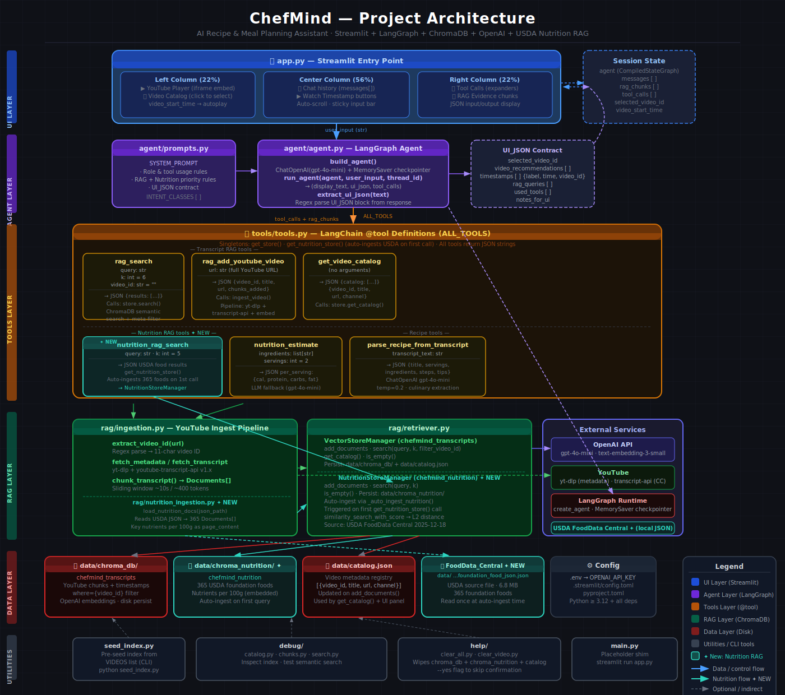

# ChefMind — AI Recipe & Meal Planning Assistant

> **Powered by YouTube RAG · LangGraph · LangChain · OpenAI · Streamlit**

---

## Summary

ChefMind is a conversational AI assistant that helps users discover recipes, understand cooking steps, estimate nutrition, and plan meals — grounded entirely in indexed YouTube cooking videos.

Users interact through a clean 3-column Streamlit chat interface. Under the hood, a LangGraph agent selects from 6 domain-specific tools to search a ChromaDB vector store of YouTube transcripts, query USDA FoodData Central nutrition data, ingest new videos on demand, and extract structured recipes from raw transcript text.

**Key capabilities:**
- Search indexed cooking videos by ingredient, technique, or recipe name
- Get exact timestamps for specific cooking steps (e.g. "when do they add garlic?")
- Add any YouTube cooking video to the knowledge base via chat
- Estimate nutrition from ingredients using USDA data or LLM fallback
- Parse raw transcript text into clean, structured recipe cards
- Multi-language: detects user language and responds accordingly
- Track token usage and cost per turn in the UI

---

## Specifications



### Tech Stack

| Layer | Technology |
|-------|-----------|
| LLM | OpenAI `gpt-4o-mini` via LangChain `ChatOpenAI` |
| Embeddings | OpenAI `text-embedding-ada-002` via LangChain `OpenAIEmbeddings` |
| Agent | LangGraph `create_react_agent` with `MemorySaver` checkpointer |
| Vector DB | ChromaDB (two collections: transcripts + USDA nutrition) |
| Transcript | `youtube-transcript-api` (time-aligned) + `yt-dlp` (metadata) |
| Nutrition DB | USDA FoodData Central — 365 foundation foods |
| UI | Streamlit 3-column layout |

### Project Structure

```
cspyro-AE.2.5/
├── app.py                        # Streamlit entry point (3-column UI)
├── agent/
│   ├── agent.py                  # LangGraph agent, run_agent(), UI_JSON extraction
│   └── prompts.py                # SYSTEM_PROMPT, intent classes, UI_JSON contract
├── rag/
│   ├── ingestion.py              # YouTube ingest pipeline (yt-dlp + transcript-api)
│   ├── retriever.py              # VectorStoreManager + NutritionStoreManager (ChromaDB)
│   └── nutrition_ingestion.py    # USDA FoodData Central JSON → Documents
├── tools/
│   └── tools.py                  # 6 LangChain @tool definitions
├── data/
│   ├── chroma_db/                # Persisted transcript vector store (runtime)
│   └── chroma_nutrition/         # Persisted USDA nutrition store (runtime)
├── help/
│   ├── clear_all.py              # CLI: wipe all RAG data + nutrition index
│   └── clear_video.py            # CLI: remove a single video from the index
├── debug/                        # Development/inspection utilities
├── seed_index.py                 # Batch-index a list of YouTube URLs
└── pyproject.toml
```

### Tools

| # | Tool | Purpose |
|---|------|---------|
| 1 | `rag_search` | Semantic search over indexed YouTube transcripts |
| 2 | `rag_add_youtube_video` | Ingest a YouTube URL into the RAG knowledge base |
| 3 | `get_video_catalog` | List all indexed videos |
| 4 | `nutrition_rag_search` | Search USDA FoodData Central for precise nutritional data |
| 5 | `nutrition_estimate` | LLM-based nutrition estimate from an ingredient list |
| 6 | `parse_recipe_from_transcript` | Convert raw transcript text into a structured recipe |

### RAG Data Model

Each transcript chunk stored in ChromaDB contains:

```
video_id · title · channel · url · published_at
chunk_text · start_time_sec · end_time_sec
```

Chunking strategy: sliding window of ~60 seconds / ~400 tokens, preserving time alignment so every chunk maps to an exact `start_time_sec → end_time_sec` range.

### UI_JSON Contract

Every agent response ends with a machine-parsed block that drives Streamlit panel updates:

```json
UI_JSON: {
  "selected_video_id": "abc123",
  "video_recommendations": [{"video_id": "...", "title": "...", "url": "..."}],
  "timestamps": [{"label": "Add garlic", "time": "03:42", "video_id": "..."}],
  "rag_queries": ["chicken pasta recipe"],
  "used_tools": ["rag_search"],
  "notes_for_ui": "Show first video in player"
}
```

### Running the App

```bash
# 1. Install dependencies
uv sync

# 2. Set your OpenAI API key
cp .env.example .env
# edit .env → OPENAI_API_KEY=sk-...

# 3. Download USDA FoodData Central data (required for nutrition features)
#    a. Go to: https://fdc.nal.usda.gov/download-datasets
#    b. Under "Foundation Foods", download the JSON format file
#    c. Rename and place the file at:
mkdir -p data
mv ~/Downloads/FoodData_Central_foundation_food_json_*.json \
   data/FoodData_Central_foundation_food_json_2025-12-18.json
#    The file is auto-ingested into ChromaDB on the first nutrition query.
#    To re-ingest manually: python rag/nutrition_ingestion.py

# 4. (Optional) Pre-index YouTube videos
python seed_index.py

# 5. Launch
streamlit run app.py
```

> **Note on USDA data:** The JSON file (~7 MB) is excluded from the repository
> because it is a redistributable dataset that users should download directly
> from the official USDA source. If the file is missing, `nutrition_rag_search`
> will return no results and the agent will fall back to `nutrition_estimate`
> (LLM-based) automatically.

---

## Core Requirements Evaluation

### RAG Implementation

| Requirement | Status | Notes |
|-------------|--------|-------|
| Create a knowledge base relevant to your domain | ✅ | Two ChromaDB collections: YouTube cooking transcripts + USDA FoodData Central (365 foods) |
| Implement standard document retrieval with embeddings | ✅ | OpenAI `text-embedding-ada-002`, ChromaDB similarity search with L2 distance scoring |
| Use chunking strategies and similarity search | ✅ | Time-aligned sliding window chunking (~60 sec / ~400 tokens); `filter_video_id` for scoped retrieval |

### Tool Calling

| Requirement | Status | Notes |
|-------------|--------|-------|
| Implement at least 3 different tool calls | ✅ | 6 tools implemented (well above minimum) |
| Functions should be relevant to your domain | ✅ | All tools are cooking/recipe/nutrition focused |
| Examples: data analysis, calculations, API integrations | ✅ | Nutrition calculation (`nutrition_estimate`), USDA data retrieval (`nutrition_rag_search`), video ingestion pipeline (`rag_add_youtube_video`) |

### Domain Specialisation

| Requirement | Status | Notes |
|-------------|--------|-------|
| Choose a specific domain | ✅ | Cooking recipes & meal planning |
| Create a focused knowledge base | ✅ | YouTube cooking transcripts + USDA nutrition database |
| Implement domain-specific prompts and responses | ✅ | Detailed `SYSTEM_PROMPT` with intent mapping table, RAG discipline rules, tool priority rules, and UI_JSON output contract |
| Add relevant security measures | ✅ | No hardcoded keys; secrets via `.env`; API key presence validated before agent invocation; `.env` excluded from git |

### Technical Implementation

| Requirement | Status | Notes |
|-------------|--------|-------|
| Use LangChain for OpenAI API integration | ✅ | `ChatOpenAI` + `OpenAIEmbeddings` via LangChain; agent via LangGraph `create_react_agent` |
| Implement proper error handling | ✅ | `try/except` in all tools, ingestion pipeline, and UI rendering; graceful fallbacks throughout |
| Add logging and monitoring | ✅ | Python `logging` in `ingestion.py`, `retriever.py`, `tools.py`, `agent.py`; Usage & Costs panel tracks per-turn token counts and USD cost |
| Include user input validation | ✅ | API key check before agent call; URL validation in ingestion; empty-result handling in all tools |
| Implement rate limiting and API key management | ✅ | API key loaded from `.env` via `python-dotenv`; key validated at runtime before each session |

### User Interface

| Requirement | Status | Notes |
|-------------|--------|-------|
| Create an intuitive interface | ✅ | 3-column Streamlit layout: catalog + player / chat / right panels; custom dark theme |
| Show relevant context and sources | ✅ | RAG Evidence panel: retrieved chunks with video title, URL, timestamps, L2 score, and transcript excerpt |
| Display tool call results | ✅ | Tool Calls panel: collapsible per-tool expanders showing JSON input + output |
| Include progress indicators for long operations | ✅ | `st.spinner("ChefMind is thinking…")` during agent invocation |

---

## Optional Tasks Evaluation

### Easy

| Task | Status | Notes |
|------|--------|-------|
| Add conversation history and export functionality | ⚠️ Partial | Conversation history maintained via `MemorySaver` checkpointer across turns; export to file not implemented |
| Add visualisation of RAG process | ✅ | RAG Evidence panel displays retrieved chunks, queries used, scores, and source timestamps |
| Include source citations in responses | ✅ | Agent always includes video title + URL when referencing content; timestamps linkable via "Watch in video" buttons |
| Add an interactive help feature or chatbot guide | ❌ | Not implemented |

### Medium

| Task | Status | Notes |
|------|--------|-------|
| Implement multi-model support | ❌ | Only `gpt-4o-mini`; architecture supports swapping model via `build_agent()` |
| Add real-time data updates to knowledge base | ✅ | `rag_add_youtube_video` tool lets users add new videos during a live session; auto-ingest of USDA nutrition data on first query |
| Implement advanced caching strategies | ❌ | No explicit caching layer |
| Add user authentication and personalisation | ❌ | Not implemented |
| Calculate and display token usage and costs | ✅ | "Usage & Costs" panel: per-turn and session totals for input tokens, output tokens, and USD cost (gpt-4o-mini rates) |
| Add visualisation of tool call results | ✅ | Tool Calls panel: collapsible JSON viewer for each tool invocation |
| Implement conversation export in various formats | ❌ | Not implemented |
| Connect to tools from a publicly available remote MCP server | ❌ | Researched and designed (Brave Search + Fetch MCP identified as best fit); not yet built |

### Hard

| Task | Status | Notes |
|------|--------|-------|
| Deploy to cloud with proper scaling | ❌ | Local only |
| Implement advanced indexing (RAPTOR, ColBERT) | ❌ | Standard flat similarity search |
| Implement A/B testing for different RAG strategies | ❌ | Not implemented |
| Add automated knowledge base updates | ❌ | Manual ingestion only |
| Fine-tune the model for specific domain | ❌ | Uses base `gpt-4o-mini` |
| Add multi-language support | ✅ | System prompt instructs agent to detect user language and respond accordingly; works out of the box for any language supported by `gpt-4o-mini` |
| Implement advanced analytics dashboard | ❌ | Basic per-turn token/cost metrics only |
| Implement your tools as MCP servers | ❌ | Tools implemented as LangChain `@tool` functions; MCP server layer not added |
| Implement an evaluation of your RAG system | ❌ | No RAGAs or other evaluation framework |
